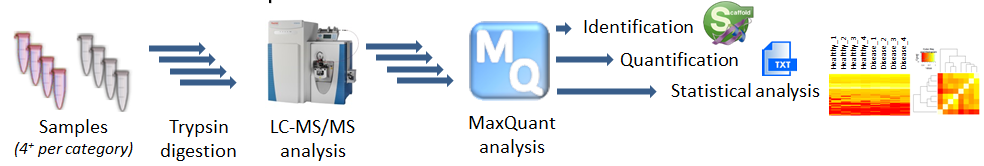

<style>
.forceBreak { -webkit-column-break-after: always; break-after: column; }
</style>

```{r setup, include=FALSE}
knitr::opts_chunk$set(echo = TRUE, message = FALSE, eval=TRUE)
source("help-functions.R")

library(protViz)
```

## Overview

### Key aspects

* How do we apply R for computational MS (compMS)?
* What have we learned during our own R software development projects?
* Which role will R play in the future compMS landscape?

### Perspectives

* User
* Developer

Disclaimer: Both views are biased by our professional environment

## Our professional environment

The Functional Genomics Center Zurich (FGCZ) is a joint state-of-the-art research and training (core) facility of ETH Zurich and University of Zurich.

[https://fgcz.ch/](https://fgcz.ch/)

We offer/support analytical services, training, collaborative R&D in:

* Genomics
* Metabolomics
* Proteomics

Proteomics currently operates ~12 MS (mostly LC-ESI-MS). Many Orbitraps, fewer TOFs. 

# How do we apply R for compMS?

## How we use R

### Tasks

* Generation of sample queues
* System suitability/quality control
* LC-MS method optimization (rawDiag)
* Statisical analysis (MSstats, proLFQua, TPP, ...)
* Reporting (Rmarkdown)

### Modes

* Interactive web applications (Shiny) connected to our core LIMS system
* Scripts are running on HPC cluster as parts of analysis pipelines

## Why we like R... in general 

> - R is free and open-source
> - R provides an active and engaged community (ask questions, find support)
> - R code development is fast
> - R code runs on all major hardware platforms (incl. HPC clusters and MC computing)
> - R has become the go-to language for statistical modeling/Data Science
> - R provides powerful graphical frameworks for data visualization
> - A bit of personal history ;-)

## A case study {data-background-size=cover}

LFQ service workflow (includes all tasks listed before)




## Example R code snippet {.columns-2 .smaller}

for generating an LC-MS instrument queue, e.g., for a 48 well plate 85.4x127.5mm

```{r plate, error=TRUE}
set.seed(1)

plate <- 
  data.frame(group = c(rep('A', 15),
                       rep('B', 15),
                       rep('C', 15))) |>
  assignPlatePosition() |>
  blockRandom(x = "group") |> 
  insertSamples(howoften=4,
        stdPosX='6', stdPosY='F', plate=1,
        stdName = "clean",
        volume=2,
        method="C:\\Xcalibur\\general_clean") 

```

<p class="forceBreak"></p>

```{r plotPlate, fig.width=4.5, fig.height=5, echo=FALSE}
op <- par(mar=c(4,4,1,1))
  .plotPlate(plate, 'group')
```

## Example R code snippet TIC {.smaller}

```{r EH4547.raw, error=TRUE, message = FALSE, warning = FALSE, echo = FALSE}
## fetch raw file using ExperimentHub
## data is part of tartare package
## https://bioconductor.org/packages/3.14/data/experiment/html/tartare.html
library(ExperimentHub)
eh <- ExperimentHub::ExperimentHub()
EH4547 <- normalizePath(eh[["EH4547"]])

(EH4547.raw <- paste0(EH4547, ".raw"))

if (!file.exists(EH4547.raw)){
  file.copy(EH4547, EH4547.raw)
}
```

```{r xic, error=TRUE, fig.width=10, fig.height=3.5}
rawrr::readChromatogram(rawfile = EH4547.raw, type = "tic") |>
  plot()
```

https://bioconductor.org/packages/release/bioc/vignettes/rawrr/inst/doc/rawrr.html


# What have we learned during our own R software development projects?

# Which role will R play in the future compMS landscape?

## The rise of machine learning

* In general we expect a steady increase of ML/DL in compMS
* The two primary languages for these tasks are Python and R
* More and more frameworks, APIs and interfaces become available (Keras, TensorFlow, ...)
* Many Data Science teams today are bilingual and some even sense a R & Python love story.
* It becomes common to have mixed code, shared environments ([reticulate](https://rstudio.github.io/reticulate/?_ga=2.198172463.1830294086.1636107730-57468228.1602754776))

```{r, echo=FALSE, out.width="25%", error=TRUE}
knitr::include_graphics("reticulated_python.png")
```

## Closer collaboration of Python and R for compMS?

* [PyOpenMS](https://github.com/OpenMS/OpenMS/wiki/pyOpenMS)
* [Pyteomics](https://github.com/levitsky/pyteomics)
* [AlphaPept](https://github.com/MannLabs/alphapept) framework for MS-based proteomics
* [AlphaTims](https://github.com/MannLabs/alphatims) Access to tdf-formated data
* [TimsPy](https://github.com/MatteoLacki/timspy) & [TimsR](https://github.com/MatteoLacki/timsr)

Will proteomics frameworks in R and Python also move closer together?


## Possible Discussion Items

### DL py or R

### Container - Scalable Data Analysis
https://analyticalsciencejournals.onlinelibrary.wiley.com/doi/epdf/10.1002/pmic.201900147

### Future community setup

# Appendix

## FGCZ Orbitrap run statistics

```{r numberRuns, fig.retina=3, echo=FALSE}
S <- data.frame(year = c(2012:2020),
           all = c(12295, 15982, 15190, 16726, 19251, 24588, 28814, 30531, 27176),
           clean = c(881, 1788, 1700,  2228, 2121, 2965, 4097, 6677, 6529),
           qc = c(1952,  3326, 2542,2821, 4027, 4435, 5640, 5247, 3761))
plot(all ~ year, data=S, pch=16, type='b', lwd=2, ylim=c(0,max(S$all)), xlim=c(2012,2020), ylab='number of runs'); lines(S$qc ~ S$year,type='b', col='red'); lines(S$clean ~ S$year,type='b', col='green'); legend("topleft", c('all', 'qc', 'clean'), pch=16, col=c('black', 'red', 'green')); box(); lines(S$all-(S$qc +S$clean) ~ S$year,type='b', col='blue');
```

15 Orbitrap LC-MS systems (Proteomics & Metabolomics)

<div class='notes'>
|year  |  2012|  2013|  2014|  2015|  2016|  2017|  2018|  2019|  2020| 2021|
|:-----|-----:|-----:|-----:|-----:|-----:|-----:|-----:|-----:|-----:|----:|
|all   | 12295| 15982| 15190| 16726| 19251| 24588| 28814| 30531| 27176| 6261|
|clean |   881|  1788|  1700|  2228|  2121|  2965|  4097|  6677|  6529| 1449|
|qc    |  1952|  3326|  2542|  2821|  4027|  4435|  5640|  5247|  3761|  820|

</div>


## R proteomics packages

### CRAN

https://CRAN.R-project.org/package=opentimsr 
https://CRAN.R-project.org/package=protViz
 
### Bioconductor

https://bioconductor.org/packages/release/BiocViews.html#___Proteomics
 
## Session information {.smaller}

```{r sessioninfo, echo=FALSE}
sessionInfo()
```

