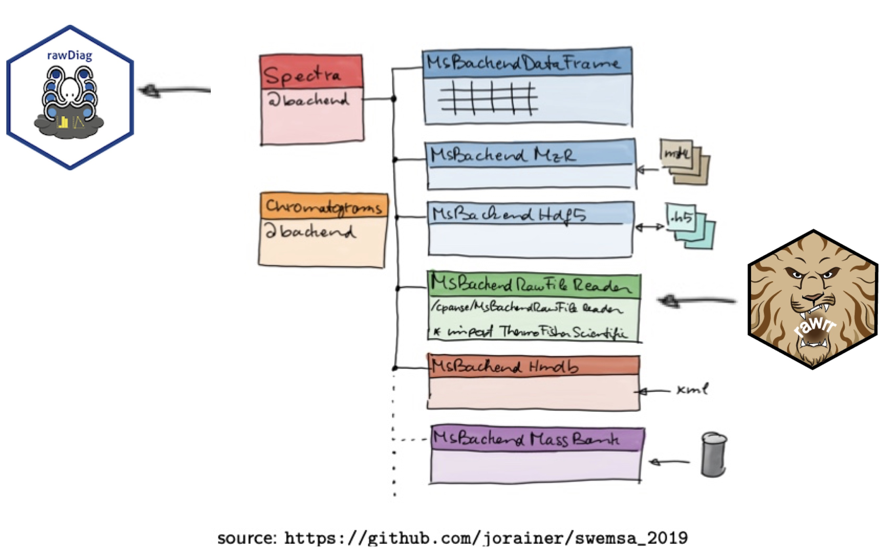
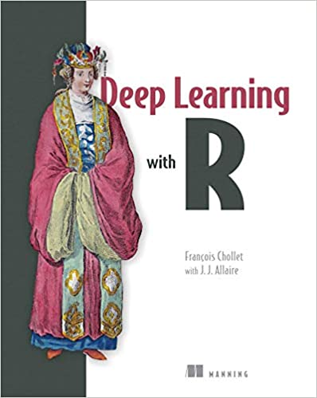
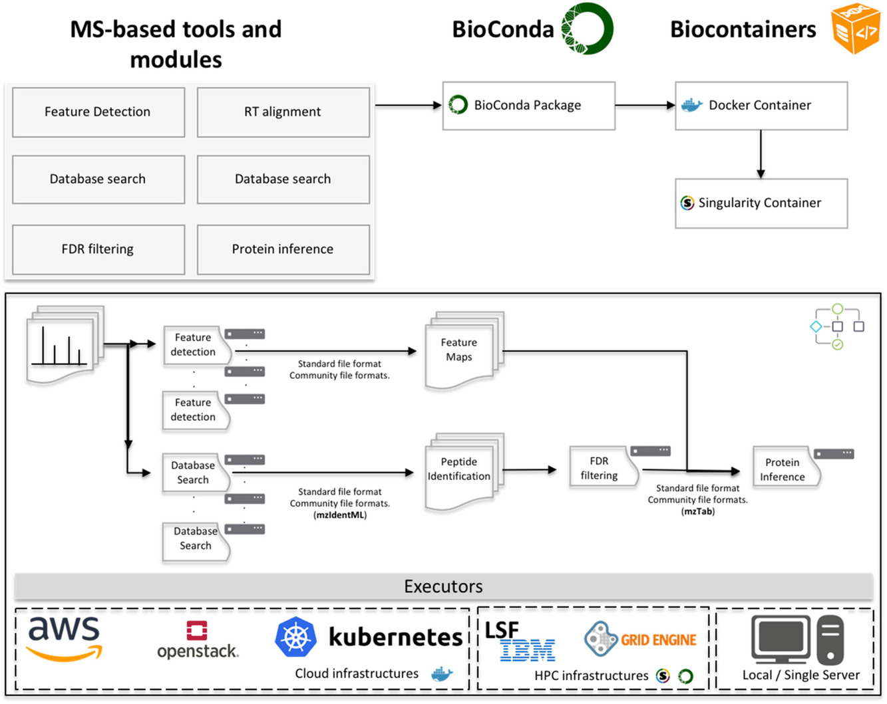

<style>
.forceBreak { -webkit-column-break-after: always; break-after: column; }
</style>

```{r setup, include=FALSE}
knitr::opts_chunk$set(echo = TRUE,  eval=TRUE, message=FALSE, warning=FALSE)
source("help-functions.R")
library(protViz)
```

## Overview

### Key aspects

* How do we apply R for computational MS (compMS)?
* What have we learned during our own R software development projects?
* Which role will R play in the future compMS landscape?

### Perspectives

* User
* Developer

Disclaimer: Both views are biased by our professional environment

## Our professional environment

The Functional Genomics Center Zurich (FGCZ) is a joint state-of-the-art research and training (core) facility of ETH Zurich and University of Zurich.

[https://fgcz.ch/](https://fgcz.ch/)

We offer/support analytical services, training, collaborative R&D in:

* Genomics
* Metabolomics
* Proteomics

Proteomics currently operates ~12 MS (mostly LC-ESI-MS). Many Orbitraps, fewer TOFs. 

# How do we apply R for compMS?

## How we use R

### Tasks

* Generation of sample queues
* System suitability/quality control
* LC-MS method optimization (rawDiag)
* Statisical analysis (MSstats, proLFQua, TPP, ...)
* Reporting (Rmarkdown)

### Modes

* Interactive web applications (Shiny) connected to our core LIMS system
* Scripts are running on HPC cluster as parts of analysis pipelines

## Why we like R... in general?

> - R is free and open-source
> - R provides an active and engaged community (ask questions, find support)
> - R code development is fast
> - R code runs on all major hardware platforms (incl. HPC clusters and MC computing)
> - R has become the go-to language for statistical modeling/Data Science
> - R provides powerful graphical frameworks for data visualization
> - A bit of personal history ;-)

## A case study {data-background-size=cover}

LFQ service workflow (includes all tasks listed before)


## Example: define 48 well {.columns-2 .smaller .build}

for generating an LC-MS instrument queue, e.g., for a 48 well plate 85.4x127.5mm

```{r plate, error=TRUE}
set.seed(1)

plate <- 
  data.frame(group = c(rep('a', 4),
                       rep('b', 4),
                       rep('c', 4))) |>
  assignPlatePosition() |>
  blockRandom(x = "group") |> 
  insertSamples(howoften=4,
        stdPosX='6', stdPosY='F', plate=1,
        stdName = "clean",
        volume=2,
        method="C:\\Xcalibur\\general_clean") |>
  insertSamples(howoften=4,
        stdPosX='8', stdPosY='F', plate=1,
        stdName = "autoQC01",
        volume=1,
        method="C:\\Xcalibur\\autoQC01") 
```

<p class="forceBreak"></p>

```{r plotPlate, fig.width=4.5, fig.height=5, echo=FALSE}
op <- par(mar=c(4,4,1,1))
  .plotPlate(plate, 'group')
```

<div class='notes'>
```{r formatXCalibur}
plate$id <- 1:nrow(plate)
plate |>
  protViz:::formatXCalibur(path=sprintf("D:\\Data2San\\p%d\\Proteomics\\%s\\%s_%s",
                                        3000,
                                        "LTQFT_1",
                                        "cpanse",
                                        format(Sys.time(), "%Y%m%d"))) |>
  head() |>
  knitr::kable()
```
</div>

## A case study - LFQ service workflow {data-background-size=cover}


## Example: XIC for iRT peptide precursors {.smaller}

```{r EH4547.raw, error=TRUE, message = FALSE, warning = FALSE, echo = FALSE}
## fetch raw file using ExperimentHub
## data is part of tartare package
## https://bioconductor.org/packages/3.14/data/experiment/html/tartare.html
library(ExperimentHub)
eh <- ExperimentHub::ExperimentHub()
EH4547 <- normalizePath(eh[["EH4547"]])

EH4547.raw <- paste0(EH4547, ".raw")

if (!file.exists(EH4547.raw)){
  file.copy(EH4547, EH4547.raw)
}

iRTmz <- c(487.2571, 547.2984, 622.8539, 636.8695, 644.8230, 669.8384, 683.8282,
           683.8541, 699.3388, 726.8361, 776.9301)
names(iRTmz) <- c("LGGNEQVTR", "YILAGVENSK", "GTFIIDPGGVIR", "GTFIIDPAAVIR", "GAGSSEPVTGLDAK",
  "TPVISGGPYEYR", "VEATFGVDESNAK", "TPVITGAPYEYR", "DGLDAASYYAPVR", "ADVTPADFSEWSK", "LFLQFGAQGSPFLK")
```

```{r xic, error=TRUE, fig.width=10, fig.height=4, echo=TRUE, message=FALSE, warning=FALSE}
(XIC <- 
  rawrr::readChromatogram(EH4547.raw, mass = iRTmz, tol = 10, type = "xic", filter = "ms")) |> 
  plot(diagnostic = TRUE)
```

https://bioconductor.org/packages/release/bioc/vignettes/rawrr/inst/doc/rawrr.html

<div class='notes'>
```{r autoQC01lm}
iRTscore <- c(-24.92, 19.79, 70.52, 87.23, 0, 28.71, 12.39, 33.38,
              42.26, 54.62, 100)
rt <- sapply(XIC, function(x) x$times[which.max(x$intensities)[1]])
fit <- lm(rt ~ iRTscore)
```

```{r autoQC01lmPlot,  fig.height=5, fig.width=5, echo=FALSE}
plot(rt ~ iRTscore,
     ylab = 'Retention time [min]',
     xlab = "iRT score",
     pch=16,frame.plot = FALSE)
abline(fit, col = 'grey')
abline(v = 0, col = "grey", lty = 2)
legend("topleft", legend = paste("Regression line: ", "rt =",
                                 format(coef(fit)[1], digits = 4), " + ",
                                 format(coef(fit)[2], digits = 2), "score",
                                 "\nR2: ", format(summary(fit)$r.squared, digits = 2)),
       bty = "n", cex = 0.75)
text(iRTscore, rt, iRTmz, pos=1,cex=0.5)

```
</div>

## A case study - LFQ service workflow {data-background-size=cover}


## Example:  Differential abundance analysis {.smaller .build}

```{r echo=TRUE, eval=TRUE, message=FALSE, warning=FALSE}
d <- prolfqua::data_ionstar$filtered()                # load peptide level data
```
```{r}
lfqd <- prolfqua::LFQData$new(d$data, d$config)       # create R6 obejct
```
```{r}
lfqt <- lfqd$get_Transformer()$log2()$robscale()$lfq # transform intensities
lfqp <- lfqt$get_Aggregator()$medpolish()             # infer protein intensities from peptide intensities
```
fit model
```{r}
models <- prolfqua::build_model(lfqp, prolfqua::strategy_lm( "medpolish ~ dilution."))
# output contains a linear model for each protein
                               
contr <- prolfqua::Contrasts$new(models,                
     c("b versus a" = "dilution.b - dilution.a",
       "c versus b" = "dilution.c - dilution.b") )  # compute contrasts
```
source: https://wolski.github.io/prolfqua/

<div class='notes'>
```{r volcano, fig.height=3, fig.width=5}
pl <- contr$get_Plotter() # call constructor for plot device
pl$volcano()$FDR + ggplot2::theme(legend.position = "bottom")
```
</div>

# What have we learned during our own R software development?

## R packages

- [protViz](https://cran.r-project.org/package=protViz) ~10yrs on CRAN mainly used for training and teaching
- [rawDiag](https://github.com/fgcz/rawDiag) only GitHub (source + releases)
- [rawrr](https://bioconductor.org/packages/release/bioc/html/rawrr.html) BioC 3.14 Software package
- [MsBackendRawFileReader](https://bioconductor.org/packages/release/bioc/html/MsBackendRawFileReader.html) BioC 3.14 Software package
- [tartare](https://bioconductor.org/packages/release/data/experiment/html/tartare.html) BioC 3.14 ExpHub package
- [proLFQua](https://github.com/wolski/prolfqua) only GitHub (source + releases)
- [bfabric](https://fgcz-bfabric.uzh.ch) closed source internal package for connecting to our data management system via REST/SOAP

## FAIR principles for research software written in R {.smaller}

**Make research software findable, accessible, interoperable, and reusable (FAIR)!**[^1]

Using [Bioconductor](https://bioconductor.org/) (BioC) tools is a great way to implement these principles!

Develop and release your R code as BioC software package:

- Automated checks (`R CMD check`, `BiocCheck()`)
- Professional peer review by a research software engineer (BioC core team)
- Unit tests (`devtools::testthat()`) and CI (building the package on different platforms)
- Documentation (man pages, vignettes)
- Dependency management
- Code style
- Installation (`BiocManager::`)

[^1]:Katz, D. S., Gruenpeter, M. & Honeyman, T. Patterns 2, 100222 (2021).

## Grow package ecosystems

- Think about using additional BioC package types for data & metadata: Annotation/Experiment Data(Hub), [Workflow](https://contributions.bioconductor.org/workflow-packages.html)
- Write packages that solve specific & well defined tasks and connect them in package ecosystems (prime example: [tidyverse](https://www.tidyverse.org/)).
- ~~Monolytic packages that try to solve everything.~~


```{r RforMSlogo, echo=FALSE, out.width="20%", error=TRUE}

```

https://www.rformassspectrometry.org/

***

```{r ecosystem, echo=FALSE, out.width="100%", error=TRUE}

```

# Which role will R play in the future compMS landscape?

## The rise of machine learning

- In general we expect a steady increase of ML/DL in compMS
- The two primary languages for these tasks are Python and R
- More and more frameworks, APIs and interfaces become available (Keras, TensorFlow, ...)

```{r DeepLearning, echo=FALSE, out.width="25%", error=TRUE}
#knitr::include_graphics("reticulated_python.png")



```

## Closer collaboration of Python and R in compMS?

- Many Data Science teams today are bilingual and some even sense a R & Python love story.
- It becomes common to have mixed code, shared environments ([reticulate](https://rstudio.github.io/reticulate/?_ga=2.198172463.1830294086.1636107730-57468228.1602754776))

Proteomics frameworks in Python:

- [PyOpenMS](https://github.com/OpenMS/OpenMS/wiki/pyOpenMS)
- [Pyteomics](https://github.com/levitsky/pyteomics)
- [AlphaPept](https://github.com/MannLabs/alphapept)

Will proteomics frameworks in R and Python also move closer together?

```{r reticulate, echo=FALSE, out.width="20%", error=TRUE}
knitr::include_graphics("reticulated_python.png")
```

## Scalable Data Analysis for Proteomics

```{r, echo=FALSE, out.width="45%", error=TRUE, fig.align='center', fig.cap="Perez‐Riverol, Y. & Moreno, P. Proteomics 20, 2020.", }

```

- R fits well into concept of distributed & modular analysis workflows
- R is a good tool for scalable and reproducible data analysis!

## Thanks

- Download: https://github.com/fgcz/RprxHUPO2021
- Questions (also any time later): https://github.com/fgcz/RprxHUPO2021/issues

```{r ErnieBert, echo=FALSE, out.width="45%", error=TRUE, fig.align='center'}
knitr::include_graphics("https://cdn-s-www.dna.fr/images/3FF17789-0AEA-4D41-B05E-78FF17D6D36C/NW_detail/title-1544616741.jpg")
```


# Appendix

## FGCZ Orbitrap run statistics

```{r numberRuns, fig.retina=3, echo=FALSE}
S <- data.frame(year = c(2012:2020),
           all = c(12295, 15982, 15190, 16726, 19251, 24588, 28814, 30531, 27176),
           clean = c(881, 1788, 1700,  2228, 2121, 2965, 4097, 6677, 6529),
           qc = c(1952,  3326, 2542,2821, 4027, 4435, 5640, 5247, 3761))
plot(all ~ year, data=S, pch=16, type='b', lwd=2, ylim=c(0,max(S$all)), xlim=c(2012,2020), ylab='number of runs'); lines(S$qc ~ S$year,type='b', col='red'); lines(S$clean ~ S$year,type='b', col='green'); legend("topleft", c('all', 'qc', 'clean'), pch=16, col=c('black', 'red', 'green')); box(); lines(S$all-(S$qc +S$clean) ~ S$year,type='b', col='blue');
```

15 Orbitrap LC-MS systems (Proteomics & Metabolomics)

<div class='notes'>
|year  |  2012|  2013|  2014|  2015|  2016|  2017|  2018|  2019|  2020| 2021|
|:-----|-----:|-----:|-----:|-----:|-----:|-----:|-----:|-----:|-----:|----:|
|all   | 12295| 15982| 15190| 16726| 19251| 24588| 28814| 30531| 27176| 6261|
|clean |   881|  1788|  1700|  2228|  2121|  2965|  4097|  6677|  6529| 1449|
|qc    |  1952|  3326|  2542|  2821|  4027|  4435|  5640|  5247|  3761|  820|

</div>


## R proteomics packages

### CRAN

https://CRAN.R-project.org/package=opentimsr 
https://CRAN.R-project.org/package=protViz
 
### Bioconductor

https://bioconductor.org/packages/release/BiocViews.html#___Proteomics
 
## Session information {.smaller}

```{r sessioninfo, echo=FALSE}
sessionInfo()
```

